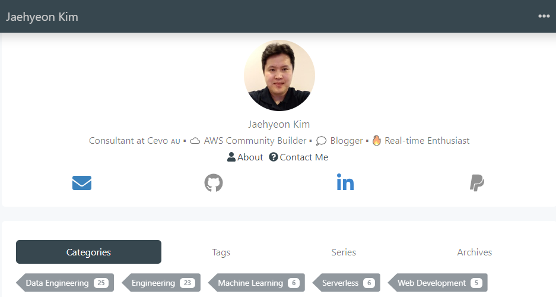

# jaehyeon.me

Source for [jaehyeon.me](https://jaehyeon.me), a blog on data engineering, streaming, analytics and architecture, written by Jaehyeon Kim, a data engineer working on data streaming for machine learning and AI.



Built with [Hugo](https://gohugo.io/) and [Hugo Bootstrap Theme](https://github.com/razonyang/hugo-theme-bootstrap), which is installed as a Hugo module rather than a submodule, so there is nothing to clone into `themes/`.

## Prerequisites

- Hugo extended 0.123.0. The deploy pins this version, so a newer one may render differently.
- Node 20. The theme ships its JavaScript and SCSS through npm.
- Go on `PATH`. Hugo resolves the theme module with it, and the build fails without it.

Docker avoids all three: `docker compose up` runs the pinned image from `docker-compose.yml`.

## Running locally

```bash
npm install
hugo server
```

The site serves at `http://localhost:1313`. With Docker instead:

```bash
docker compose up
```

Both serve drafts and future-dated posts, because `docker-compose.yml` passes `-D -F -E` and the deploy passes `--buildFuture`.

## Layout

| Path | What it holds |
|---|---|
| `content/blog/` | One folder per post, each with `index.md` and its images |
| `content/slides/` | Reveal.js decks, rendered by `layouts/slides/single.html` |
| `content/projects/` | The Projects page body; its cards come from `data/projects.json` |
| `config/_default/` | Site config, menu, params, author and social links |
| `layouts/` | Only the overrides. Everything else comes from the theme module |
| `assets/main/scss/_custom.scss` | Custom CSS on top of the theme |
| `static/` | Files copied to the site root as they are |

## Projects page

`/projects/` is a card grid built from `data/projects.json` rather than from content pages, so it carries no dates and reordering is a matter of changing `weight`. Each entry gives `name`, `repo`, `weight`, `description`, an optional `url` for the writing behind it, and `image`, which names a file under `assets/projects/`.

Card images are generated by `scripts/make-project-cards.py`, which needs Pillow and nothing else. Add the entry to `data/projects.json`, run the script from the repository root, and commit the PNG it writes.

```bash
python3 -m venv venv && source venv/bin/activate
pip install -r scripts/requirements.txt
python3 scripts/make-project-cards.py
```

The images are committed, so building the site never needs Python at all.

## Deploying

Pushing to `master` runs `.github/workflows/gh-pages.yml`, which builds with `hugo --minify --gc --enableGitInfo --buildFuture` and publishes `./public` to the `gh-pages` branch. GitHub Pages serves it at the domain in `public/CNAME`, which is `jaehyeon.me`.

The production build differs from local in one way that matters: PurgeCSS runs only when `HUGO_ENVIRONMENT` is `production`, and it strips any class it cannot find in `hugo_stats.json`. A class used only inside a layout override has to be listed in `extra_stats.json`, or it works locally and disappears in production.

## Upgrading the theme

```bash
hugo mod get github.com/razonyang/hugo-theme-bootstrap@master
hugo mod npm pack
npm update
```

Then run the site locally before pushing, since the theme is pre-1.0 and its partials change.
