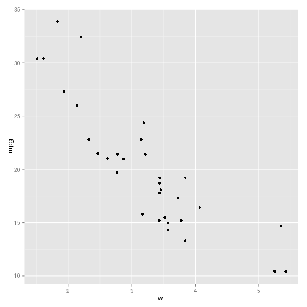
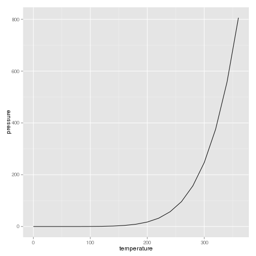
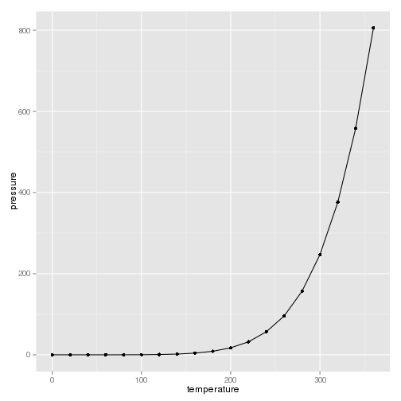
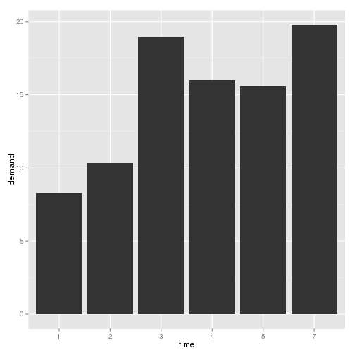
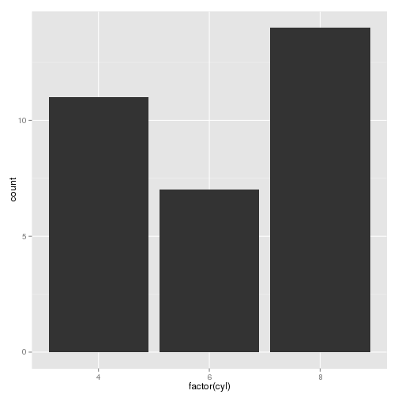
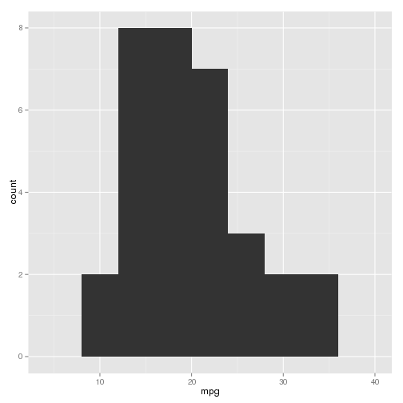
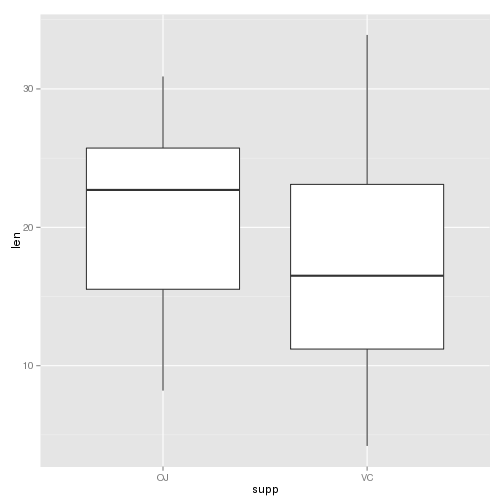



This is a quick chart test and the examples are from Chapter 2 of [R Graphic Cookbook](http://shop.oreilly.com/product/0636920023135.do).


library(ggplot2)
library(plyr)


An introduction to building is shown below.


dat <- data.frame(xval=1:4, yval=c(3,5,6,9), group=c("A","B","B","A"))
p <- ggplot(dat, aes(x=xval, y=yval))
p + geom_point()
p + geom_point(aes(color=group)) # colour by group
p + geom_point(colour="blue") # specify colour
p + geom_point() + scale_x_continuous(limit=c(0,8)) # change x range
p + geom_point() + scale_colour_manual(values=c("red","blue"))


#### Scatter plot


#qplot(wt, mpg, data=mtcars)
ggplot(mtcars, aes(x=wt, y=mpg)) + geom_point()


 

#### Line chart


#qplot(temperature, pressure, data=pressure, geom="line")
ggplot(pressure, aes(x=temperature, y=pressure)) + geom_line()


 


#qplot(temperature, pressure, data=pressure, geom=c("line","point"))
ggplot(pressure, aes(x=temperature, y=pressure)) + geom_line() + geom_point()


 

#### Bar graph


BOD <- mutate(BOD, Time=as.factor(Time))



## Error in is.factor(x): object 'Time' not found



names(BOD) <- tolower(names(BOD))

#qplot(time, demand, data=BOD, geom="bar", stat="identity")
ggplot(BOD, aes(x=time, y=demand)) + geom_bar(stat="identity")


 


#qplot(cyl, data=mtcars) # numeric <- display all values inbetween
#qplot(factor(cyl), data=mtcars) # factor <- display only if count > 0
ggplot(mtcars, aes(x=factor(cyl))) + geom_bar()


 

#### Histogram


#qplot(mpg, data=mtcars, binwidth=4) # default: binwidth = range/30
ggplot(mtcars, aes(x=mpg)) + geom_histogram(binwidth=4)


 

#### Box plot


tooth <- mutate(ToothGrowth, inter = interaction(supp, dose))
#qplot(supp, len, data=tooth, geom="boxplot")
ggplot(tooth, aes(x=supp, y=len)) + geom_boxplot()


 


#qplot(inter, len, data=tooth, geom="boxplot")
ggplot(tooth, aes(x=inter, y=len)) + geom_boxplot()


 

#### Function curve


myFun <- function(var) { 1/(1 + exp(-var + 10)) }
#qplot(c(0, 20), fun=myFun, stat="function", geom="line")
ggplot(data.frame(x=c(0, 20)), aes(x=x)) + stat_function(fun=myFun, geom="line")


 
