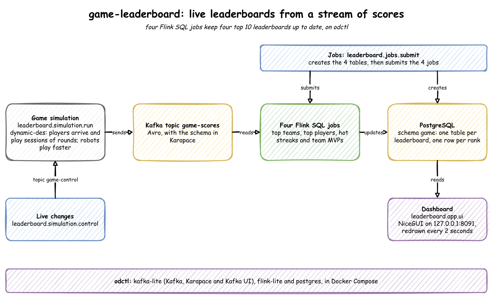

A mobile game produces a score every time a player finishes a round, and players expect the leaderboards to move as they play. In this post, a simulation plays the game and sends each score to Kafka. Four Flink SQL jobs keep four top 10 leaderboards up to date in PostgreSQL, and a web dashboard shows them as they change. Everything runs on your own machine.

<!--more-->

The source code is in [benchtop/game-leaderboard](https://github.com/jaehyeon-kim/benchtop/tree/main/game-leaderboard). It is one of the [Benchtop](/blog/2026-09-30-introducing-benchtop/) projects, which run locally from a fresh clone.

## What You Will Build

1. Run the simulation, which plays the game and sends each score to Kafka.
2. Submit the four Flink jobs, which keep the leaderboards up to date in PostgreSQL.
3. Open the dashboard, which shows the four leaderboards as they change.
4. Change the game while it runs, and watch robots take over the top players and the team MVPs.
5. Clean up, to start again.

To start again at any point, `python -m leaderboard.stores.cleanup` removes everything this project has created and keeps the services running. [Clean Up](#clean-up) describes what it removes.

The four leaderboards:

| Leaderboard | What it shows |
|---|---|
| Top teams | the 10 teams with the highest total score |
| Top players | the 10 players with the highest total score |
| Hot streaks | the 10 players scoring furthest above their usual rate: their average score over the last 10 seconds divided by their average over the last 60 seconds |
| Team MVPs | each team's top scorer and their share of the team's total, then the 10 players with the largest shares |

## Architecture



1. **Events.** A simulation built with [dynamic-des](https://github.com/jaehyeon-kim/dynamic-des) ([documentation](https://jaehyeon.me/dynamic-des/latest/getting-started/)) plays the game in real time. dynamic-des is a Python library for simulations that stream their output. Each score is published to the Kafka topic `game-scores` in Avro, a compact binary format whose schema is kept in a schema registry.
2. **Leaderboards.** Four Flink SQL jobs, one per leaderboard, read the topic and compute the leaderboards. Flink is a stream processor. It keeps each query's result up to date as events arrive, rather than running the query once.
3. **Storage.** Each job writes its leaderboard to a PostgreSQL table with one row per rank. When the team or player at a rank changes, Flink updates that row.
4. **Dashboard.** A [NiceGUI](https://nicegui.io/) web page reads the four tables and redraws them every 2 seconds. NiceGUI is a Python library for web pages. The page shows the current leaderboards as soon as it opens, because the tables always hold the latest state.

The tools:

| Tool | Role here |
|---|---|
| dynamic-des | simulates the game, publishes the events to Kafka, and reads parameter changes from Kafka while it runs |
| Apache Kafka, with Karapace | carries the events; Karapace is the schema registry that holds their Avro schema |
| Apache Flink | runs the SQL jobs that compute the leaderboards |
| PostgreSQL | stores the leaderboards |
| NiceGUI | the dashboard |
| [odctl](https://github.com/jaehyeon-kim/odctl) | starts all the services above with Docker Compose |

## Setup

You need Docker (Docker Desktop, OrbStack or Docker Engine), [uv](https://docs.astral.sh/uv/) and Python 3.13. Clone the repository and run every command from the project folder:

```bash
git clone https://github.com/jaehyeon-kim/benchtop.git
cd benchtop/game-leaderboard

uv venv                             # create .venv
source .venv/bin/activate           # activate it, in each new shell
uv pip install -r requirements.txt

odctl up kafka-lite flink-lite postgres
```

odctl is a command line tool that starts a local data stack with Docker Compose. `kafka-lite` starts one Kafka broker, Karapace and Kafka UI. `flink-lite` starts a Flink cluster with one TaskManager, the process that runs a job's work. `postgres` starts PostgreSQL.

The web UIs:

- Kafka UI, for the topic and its messages: http://127.0.0.1:8086
- Flink UI, for the running jobs: http://127.0.0.1:8082

## Simulation Model

A discrete-event simulation (DES) moves a clock from one event to the next, such as a player's next round. Nothing happens between events, so the model only has to say what each event does and how long it is until the next one. Here the clock runs at the speed of real time.

The model is built from dynamic-des's parts. The teams themselves are plain Python, in `leaderboard/simulation/game.py`:

| Part of the game | dynamic-des feature | Default |
|---|---|---|
| Players arrive at random | an arrival, `player`: exponential gaps | a player every 2 seconds |
| A player's session | a process, one per player, started for each arrival | lasts a lognormal time, 5 minutes on average |
| Time between rounds | a service, `round` for people and `robot_round` for robots | 6 seconds for people, 1.5 for robots |
| A device goes offline | a service, `offline`: the score is held, then sent with the time it was earned | 7 minutes on average |
| Robots and late scores | registry variables, `robot_share` and `late_share` | 5% of players, 1% of scores |
| Sending the scores | Kafka egress, with a serializer that sends only the score | about 27 scores a second |
| Changing parameters | Kafka ingress on `game-control` | none |

The parameters and the arrival process are set in `build`, in `leaderboard/simulation/run.py`. When a player arrives, the arrival process decides whether they are a robot, then starts their session as a process of its own:

```python
def build(app: SimulationContext) -> None:
    """
    Adds the game's parameters and processes to a simulation.

    Args:
        app (SimulationContext): The simulation, before it runs.
    """
    app.add_arrival("player", dist="exponential", rate=0.5)  # a player every 2 s
    app.add_service("session", dist="lognormal", mean=300, std=120)  # 5 minutes
    app.add_service("round", dist="lognormal", mean=6, std=2)
    app.add_service("robot_round", dist="normal", mean=1.5, std=0.3)
    app.add_service("offline", dist="normal", mean=420, std=120)  # 7 minutes
    app.add_variable("robot_share", 0.05)
    app.add_variable("late_share", 0.01)

    @app.arrival_loop("player")
    def players(ctx: SimulationContext) -> Iterator[Any]:
        game = Game(ctx.sampler.rng)  # type: ignore[union-attr]
        count = 0
        while True:
            yield ctx.wait_for_arrival("player")
            count += 1
            robot = game.rng.random() < _share(ctx, "robot_share")
            ctx.spawn(
                _session(ctx, game, f"{'RBT' if robot else 'USR'}-{count:06}", robot)
            )
```

A session puts the player in a team with room, or forms a new team. A team holds up to 15 players, and one arrival in ten forms a new team anyway. The player then plays rounds until the session time is up, and each round earns a score from 0 to 20. A late score is held by a process of its own and sent minutes later, with the time it was earned. When the player leaves, they leave their team, and a team with no players left dissolves:

```python
def _session(
    ctx: SimulationContext, game: Game, player: str, robot: bool
) -> Iterator[Any]:
    """Plays one session: joins a team, plays rounds until the session ends, and leaves."""
    team = game.join(player)
    ends = ctx.env.now + _draw(ctx, "session")
    while True:
        yield ctx.env.timeout(_draw(ctx, "robot_round" if robot else "round"))
        if ctx.env.now > ends:
            break
        earned = ctx.env.start_datetime + timedelta(seconds=ctx.env.now)
        late = game.rng.random() < _share(ctx, "late_share")
        event = ScoreEvent(
            user_id=player,
            team_id=team.team_id,
            team_name=team.name,
            score=int(game.rng.integers(0, 21)),
            event_time_millis=int(earned.timestamp() * 1000),
            event_type="late" if late else "normal",
        )
        if late:
            ctx.spawn(_send_late(ctx, event))
        else:
            ctx.env.publish_event(player, event)
    game.leave(team, player)
```

Every parameter is a path in dynamic-des's registry, such as `game.variables.robot_share` or `game.service.round.mean`. The registry is a store of named parameters. The processes read the live value each time they draw one, so a change sent to `game-control` applies from the next arrival or round.

## Step 1: Run the Simulation

```bash
python -m leaderboard.simulation.run     # Ctrl + C to stop
```

It creates two Kafka topics if they are missing: `game-scores` for the scores, and `game-control` for parameter changes. It then plays the game in real time and sends about 27 scores a second until you stop it. The first score registers the Avro schema in Karapace, under the subject `game-scores-value`. Its log shows the simulation starting, and its Kafka writer and reader connecting:

```
2026-09-30 22:41:07,798 dynamic_des.core.context Simulation engine started.
2026-09-30 22:41:07,801 dynamic_des.connectors.egress.kafka Kafka Egress producer connected successfully.
2026-09-30 22:41:07,802 dynamic_des.connectors.ingress.kafka Connected to Kafka Ingress topic: game-control
```

In Kafka UI, the topic `game-scores` shows the scores. Each message is keyed by the player:

```json
{
 "key": "USR-000002",
 "value": {
  "user_id": "USR-000002",
  "team_id": "0000000001",
  "team_name": "Ruby-Wombat",
  "score": 8,
  "event_time_millis": 1790771752614,
  "event_type": "normal"
 }
}
```


## Step 2: Submit the Flink Jobs

In a second terminal, with the environment activated:

```bash
python -m leaderboard.jobs.submit
```

It creates the PostgreSQL schema `game` with the four leaderboard tables in `leaderboard/jobs/tables.sql`, then submits the four jobs:

```
2026-09-30 22:41:37,300 leaderboard.stores.flink Submitted 01-top-teams
2026-09-30 22:41:41,745 leaderboard.stores.flink Submitted 02-top-players
2026-09-30 22:41:46,280 leaderboard.stores.flink Submitted 03-hot-streaks
2026-09-30 22:41:50,970 leaderboard.stores.flink Submitted 04-team-mvps
```

Before submitting, it also copies the OpenLineage client library into Flink's `lib` folder. Flink's JDBC connector, which writes to PostgreSQL, needs it, and odctl's Flink image has a copy but not in that folder.

The jobs keep running in the Flink UI, as `game-top-teams`, `game-top-players`, `game-hot-streaks` and `game-team-mvps`. Each reads the topic from its first event, so the leaderboards include everything simulated so far.


### Shared Tables

Flink SQL reads and writes tables that are defined over external systems. `leaderboard/jobs/00-ddl.sql` defines the source table `scores`, which reads the Kafka topic, and four sink tables, each writing to its PostgreSQL table. odctl's Flink keeps table definitions only for one SQL client session, so each job loads this file first, with `sql-client.sh -i`. The source table:

```sql
-- The score events. Event time comes from the event itself, and the watermark lets
-- scores arrive up to 5 seconds out of order. Late events, minutes behind, still count
-- towards the totals, but the hot streaks' time windows leave them out.
CREATE TABLE scores (
  user_id           STRING,
  team_id           STRING,
  team_name         STRING,
  score             INT,
  event_time_millis BIGINT,
  event_type        STRING,
  event_time AS TO_TIMESTAMP_LTZ(event_time_millis, 3),
  WATERMARK FOR event_time AS event_time - INTERVAL '5' SECOND
) WITH (
  'connector' = 'kafka',
  'topic' = 'game-scores',
  'properties.bootstrap.servers' = 'broker-1:19092',
  'scan.startup.mode' = 'earliest-offset',
  'format' = 'avro-confluent',
  'avro-confluent.url' = 'http://karapace:8081'
);
```

Each event carries the time it happened, and Flink uses that time rather than the time the event arrives. This is called event time. A watermark tells Flink how long to wait for events that arrive out of order, here 5 seconds.

A sink table has the rank as its primary key. The key makes the sink an upsert: Flink replaces the row at a rank when it changes.

```sql
CREATE TABLE top_teams (
  rnk BIGINT, team_id STRING, team_name STRING, total_score BIGINT,
  PRIMARY KEY (rnk) NOT ENFORCED
) WITH (
  'connector' = 'jdbc',
  'url' = 'jdbc:postgresql://postgres:5432/odctl',
  'table-name' = 'game.top_teams',
  'username' = 'user',
  'password' = 'password',
  'sink.buffer-flush.interval' = '1s'
);
```

### One Job per Leaderboard

Each leaderboard has its own job file, from `01-top-teams.sql` to `04-team-mvps.sql`. Each file sets its own job name and settings, then runs one `INSERT` query. The top teams job, `leaderboard/jobs/01-top-teams.sql`:

```sql
-- One leaderboard job. Submit it with the shared table definitions:
--   ./bin/sql-client.sh -i /tmp/00-ddl.sql -f /tmp/01-top-teams.sql

SET 'pipeline.name' = 'game-top-teams';
SET 'parallelism.default' = '1';
-- Checkpoint every 10 seconds. The JDBC sink flushes its buffered rows at each
-- checkpoint, and after a restart the job resumes from the last checkpoint instead of
-- rebuilding its state from the start of the topic. odctl sets the checkpoint folder
-- and RocksDB state, but no interval, so the job sets it.
SET 'execution.checkpointing.interval' = '10s';
-- Keep a running total for an hour after its last score. A session lasts about 5
-- minutes and a late score arrives about 7 minutes after it was earned, so no total is
-- dropped while it can still change.
SET 'table.exec.state.ttl' = '60 min';
-- Collect updates for up to a second before writing, so a busy leaderboard is written
-- once a second rather than once per event.
SET 'table.exec.mini-batch.enabled' = 'true';
SET 'table.exec.mini-batch.allow-latency' = '1s';
SET 'table.exec.mini-batch.size' = '2000';

-- Top teams: the 10 teams with the highest total score.
INSERT INTO top_teams
SELECT rnk, team_id, team_name, total_score
FROM (
  SELECT *, ROW_NUMBER() OVER (ORDER BY total_score DESC, team_name) AS rnk
  FROM (
    SELECT team_id, MAX(team_name) AS team_name, CAST(SUM(score) AS BIGINT) AS total_score
    FROM scores
    GROUP BY team_id
  )
)
WHERE rnk <= 10;
```

The settings each job makes:

- **Checkpoints.** A checkpoint is a saved copy of a job's state. Each job checkpoints every 10 seconds. The JDBC sink writes its buffered rows at each checkpoint, and after a restart a job resumes from its last checkpoint.
- **State time to live.** Flink keeps a running total for each team or player in its state. `table.exec.state.ttl` drops a total that has not changed for the time set. The totals are kept for an hour, which is longer than a session and a late score together.
- **Mini-batches.** Each job collects updates for up to a second before writing (`table.exec.mini-batch.*`), so a busy leaderboard is written once a second rather than once per event.
- **Ranking.** Each query ranks with `ROW_NUMBER() OVER (ORDER BY ...)` and keeps ranks 1 to 10.

The hot streaks job differs in its settings. Its windows look back only 60 seconds, so it keeps a player's rows for 5 minutes. Its mini-batches are half the size. These are the settings in `leaderboard/jobs/03-hot-streaks.sql`:

```sql
SET 'pipeline.name' = 'game-hot-streaks';
SET 'parallelism.default' = '1';
-- Checkpoint every 10 seconds. The JDBC sink flushes its buffered rows at each
-- checkpoint, and after a restart the job resumes from the last checkpoint instead of
-- rebuilding its state from the start of the topic. odctl sets the checkpoint folder
-- and RocksDB state, but no interval, so the job sets it.
SET 'execution.checkpointing.interval' = '10s';
-- The windows look back 60 seconds, so a player's rows are dropped 5 minutes after
-- their last score.
SET 'table.exec.state.ttl' = '5 min';
-- Collect updates for up to a second before writing, so a busy leaderboard is written
-- once a second rather than once per event.
SET 'table.exec.mini-batch.enabled' = 'true';
SET 'table.exec.mini-batch.allow-latency' = '1s';
SET 'table.exec.mini-batch.size' = '1000';
```

Its query averages each player's scores over two windows, the last 10 seconds and the last 60 seconds, measured in event time. So late events, minutes behind, count towards the totals in the other three leaderboards, but the hot streaks leave them out.

To see a leaderboard directly in PostgreSQL:

```bash
docker exec postgres psql -U user -d odctl -c "SELECT * FROM game.top_teams ORDER BY rnk"
```

## Step 3: Open the Dashboard

```bash
python -m leaderboard.app.ui
```

```
NiceGUI ready to go on http://127.0.0.1:8091
```

Open http://127.0.0.1:8091. The four charts update every 2 seconds while the simulation runs.


## Step 4: Change the Game While It Runs

The simulation reads parameter changes from the topic `game-control` while it runs, through dynamic-des's Kafka ingress. For example, make every new player a robot:

```bash
python -m leaderboard.simulation.control game.variables.robot_share 1.0
```

```
Sent game.variables.robot_share = 1.0 to game-control
```

Robots play a round about every 1.5 seconds, four times as often as people. So within a few minutes, as the new players' sessions go on, robots (`RBT-...`) take over the top players. Before the change, the top players were mostly people:

```
 rnk |  user_id   |    team_name     | total_score 
-----+------------+------------------+-------------
   1 | RBT-000005 | Ruby-Wombat      |         603
   2 | RBT-000016 | Coral-Kookaburra |         342
   3 | RBT-000013 | Coral-Kookaburra |         321
   4 | USR-000002 | Ruby-Wombat      |         151
   5 | USR-000011 | Ruby-Wombat      |         136
   6 | USR-000007 | Ruby-Wombat      |         135
   7 | USR-000001 | Ruby-Wombat      |         133
   8 | USR-000008 | Ruby-Wombat      |         120
   9 | USR-000015 | Ruby-Wombat      |         119
  10 | USR-000014 | Coral-Kookaburra |         116
(10 rows)
```

After the change, every one of the top players was a robot:

```
 rnk |  user_id   |    team_name     | total_score 
-----+------------+------------------+-------------
   1 | RBT-000013 | Coral-Kookaburra |        1802
   2 | RBT-000016 | Coral-Kookaburra |        1645
   3 | RBT-000035 | Coral-Kookaburra |        1414
   4 | RBT-000039 | Coral-Kookaburra |        1386
   5 | RBT-000037 | Olive-Platypus   |        1351
   6 | RBT-000041 | Olive-Platypus   |        1271
   7 | RBT-000047 | Jade-Platypus    |        1263
   8 | RBT-000005 | Ruby-Wombat      |        1260
   9 | RBT-000044 | Olive-Platypus   |        1250
  10 | RBT-000046 | Jade-Platypus    |        1245
(10 rows)
```

The team MVPs changed the same way. All 10 of the top MVPs were robots:

```
 rnk |  user_id   |    team_name     | player_total | team_total |    contrib_ratio    
-----+------------+------------------+--------------+------------+---------------------
   1 | RBT-000108 | Jade-Numbat      |          235 |        475 | 0.49473684210526314
   2 | RBT-000106 | Teal-Quokka      |          297 |        613 | 0.48450244698205547
   3 | RBT-000083 | Indigo-Dingo     |          671 |       3367 |  0.1992871992871993
   4 | RBT-000086 | Olive-Numbat     |          674 |       4302 | 0.15667131566713158
   5 | RBT-000005 | Ruby-Wombat      |         1260 |       9392 | 0.13415672913117546
   6 | RBT-000013 | Coral-Kookaburra |         1820 |      13839 | 0.13151239251390998
   7 | RBT-000037 | Olive-Platypus   |         1351 |      12947 | 0.10434849772147987
   8 | RBT-000047 | Jade-Platypus    |         1279 |      12470 | 0.10256615878107458
   9 | RBT-000060 | Olive-Emu        |         1058 |      10621 | 0.09961397231899068
  10 | RBT-000068 | Jade-Kookaburra  |          900 |       9474 | 0.09499683343888538
(10 rows)
```

Set the share back with `python -m leaderboard.simulation.control game.variables.robot_share 0.05`. Other parameters work the same way. For example, `game.arrival.player.rate 2.0` brings four times as many players, and so four times as many scores. `python -m leaderboard.simulation.control --help` lists them all with their defaults.

## Clean Up

Stop the simulation and the dashboard first, then:

```bash
python -m leaderboard.stores.cleanup
```

It cancels the four Flink jobs, deletes the two Kafka topics and the schema subject, and drops the PostgreSQL schema `game` with its tables. It leaves other projects' jobs, topics and tables alone, and the services keep running. It is safe to run again. To start over, run the steps again from Step 1.

To stop the services and delete their data:

```bash
odctl down --all --volumes          # answer y; --volumes also deletes the data
deactivate
rm -rf .venv
```

## Related posts

* [Run Flink SQL Cookbook in Docker](/blog/2025-04-15-sql-cookbook) - more Flink SQL queries, from simple selects to windows and joins, run on a local cluster
* [Flink Table API - Declarative Analytics for Supplier Stats in Real Time](/blog/2025-06-17-kotlin-getting-started-flink-table) - a windowed aggregation over Kafka records with the Flink Table API, the code form of these SQL queries
* [Change Data Capture on a Simulated Online Shop with Debezium and Kafka Connect](/blog/2026-10-01-ecommerce-cdc-debezium-kafka-connect) - another Benchtop project on the same simulation library, streaming database changes from PostgreSQL to Kafka
