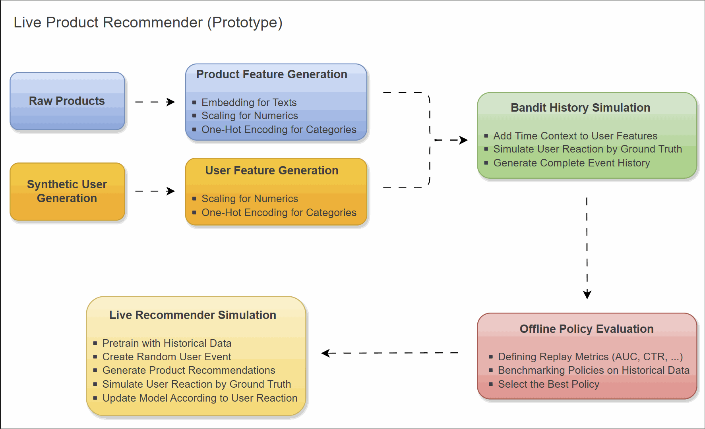
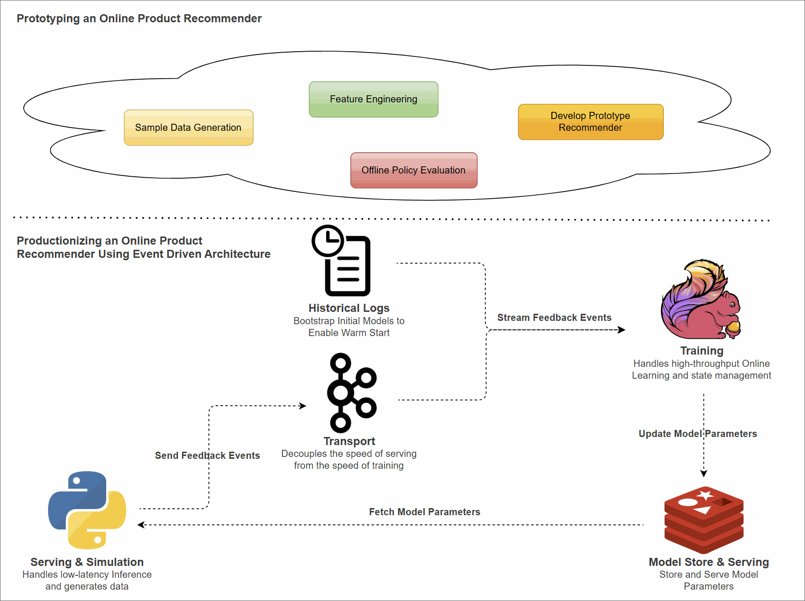

## Building a Real-Time Product Recommender

Contextual Bandits & Event-Driven Architecture

---

## Why Contextual Bandits?

- **Problem:** Conventional recommenders (e.g., Collaborative Filtering)
  - Ignore situational context (e.g., Time of Day, Location, Device).
  - Struggle with "Cold Starts" for new items/users.
- **Solution:** Contextual Multi-Armed Bandits (CMAB).
  - **Exploitation:** Maximize immediate reward using current knowledge.
  - **Exploration:** Gather information on uncertain items to improve future performance.

[Part 1: Prototype](#prototype) | [Part 2: Productionization](#production)

---

<!-- .slide: id="prototype" -->
## Part 1: Prototype

Prototype an online product recommender with Python

--

## Python Ecosystem

- [Vowpal Wabbit](https://vowpalwabbit.org/) <!-- .element: target="_blank" --> and [River ML](https://riverml.xyz/latest/) <!-- .element: target="_blank" --> are well-known for CMAB.
  - *Gap:* Lack of end-to-end examples integrating feature engineering and offline policy evaluation.
- [Fidelity Investments Open Source](https://github.com/fidelity) <!-- .element: target="_blank" -->
  - **MABWiser:** Algorithm implementation.
  - **Mab2Rec:** Offline policy evaluation.
  - **TextWiser:** Text featurization.

--

## Prototyping Workflow

From synthetic data generation to live simulation.

--

## Live Demo & Walkthrough

Let's dive into the code.

--

## Offline Policy Evaluation

| Model | AUC(score)@5 | CTR(score)@5 | Precision@5 | Recall@5 |
| :--- | :--- | :--- | :--- | :--- |
| Random | 0.550 | 0.102 | 0.003 | 0.019 |
| Popularity | 0.592 | 0.192 | 0.007 | 0.038 |
| LinGreedy | **0.885** | 0.117 | 0.004 | 0.023 |
| **🏆 LinUCB** | 0.860 | **0.204** | 0.006 | 0.034 |
| LinTS | 0.640 | 0.211 | **0.008** | **0.042** |
| ClustersTS | 0.550 | 0.153 | 0.004 | 0.023 |
<!-- .element: style="font-size: 0.5em; line-height: 1.2; width: 100%;" -->

Why LinUCB?

- **Best Trade-off:** High Ranking (AUC) + High Engagement (CTR).
- **Beats LinGreedy:** Explores effectively (CTR 0.20 vs 0.11).
- **Beats LinTS:** Ranks accurately (AUC 0.86 vs 0.64).

--

## LinUCB Algorithm

Balancing Exploitation and Exploration

$$ \text{Score}_a = \color{cyan}{x^T \theta_a} + \color{orange}{\alpha \sqrt{x^T A_a^{-1} x}} \color{white}{, \quad \text{where } \theta_a = A_a^{-1} b_a} $$

- ● **Exploitation:** Predicted reward ($x^T \theta_a$).
- ● **Exploration:** Uncertainty bonus (UCB).
- **$\theta_a = A_a^{-1} b_a$**: **Model weights** estimated via Ridge Regression.

--

## Limitations

A monolithic Python script isn't built for scale.

- **Latency:** Training blocks inference.
- **Scalability:** Matrix math in memory limits the catalog size.
- **Fault Tolerance:** If the script crashes, the learned state is lost.

[Back to Start](#/) | **[Jump to Productionization](#production)**

---

<!-- .slide: id="production" -->
## Part 2: Productionization

Scaling with an Event-Driven Architecture

--

## Architecture

Decoupling *Serving* from *Training*.

--

## Serving (Python & Redis)

- **Stateless Inference:** The client does *not* train. 
- **Low Latency:** Fetches pre-computed LinUCB parameters directly from Redis.
- **Action:** Calculates scores, ranks items, and sends user feedback to Kafka.

--

## Transport (Apache Kafka)

- **Asynchronous Buffer:** Decouples the speed of the user-facing web app from the backend training engine.
- **Durability:** Stores the "Ground Truth" feedback events safely for replay or analytics.

--

## Training (Apache Flink)

$$ \text{Score}_a = \color{cyan}{x^T \theta_a} + \color{orange}{\alpha \sqrt{x^T A_a^{-1} x}} \color{white}{, \quad \text{where } \theta_a = A_a^{-1} b_a} $$

- **Stateful Processing:** Flink acts as the system's "Online Memory" (via RocksDB).
- **Asynchronous Updates:** 
  - **Fast Path:** Updates $A$ and $b$ state for every event.
    - ($A \leftarrow A + x x^T$ and $b \leftarrow b + r x$)
  - **Slow Path:** Every 5s, computes the Matrix Inverse $A^{-1}$.
- **Sync to Redis:** Periodically emits **Inverse Matrix ($A^{-1}$)** and **Reward Vector ($b$)** for real-time serving.

--

## Live Demo & Walkthrough

Let's dive into the code.

[Back to Start](#/) | **[Jump to Takeaways](#takeaways)**

---

<!-- .slide: id="takeaways" -->
## Key Takeaways

Bridging the gap between Data Science and Data Engineering.

--

## Start Small, Evaluate Offline

- Before touching infrastructure, **evaluate policies**. 
- Using tools like *MABWiser* and *Mab2Rec* allows you to simulate user behavior and validate algorithms on historical data safely.

--

## Decouple to Scale

- A monolithic architecture forces a trade-off between model accuracy and user latency.
- **Event-Driven Architecture (EDA)** solves this by separating high-speed inference (Redis) from heavy stateful training (Flink).

--

## Real-Time Adaptability

- By integrating Kafka and Flink, the system learns from user behavior *instantly*.
  - **Dynamic Personalization:** Optimizes for specific real-time user context with every click.
  - **Continuous Learning:** Eliminates the "Cold Start" problem for new items without batch-job downtime.

---

# Thank You!

**Code & Resources:**

- [GitHub Repository](https://github.com/jaehyeon-kim/streaming-demos/tree/main/product-recommender) <!-- .element: target="_blank" -->
- Blog Posts: [Part 1: Prototype](https://jaehyeon.me/blog/2026-01-29-prototype-recommender-with-python/) <!-- .element: target="_blank" --> | [Part 2: Productionization](https://jaehyeon.me/blog/2026-02-23-productionize-recommender-with-eda/) <!-- .element: target="_blank" -->

[Back to Start](#/)
