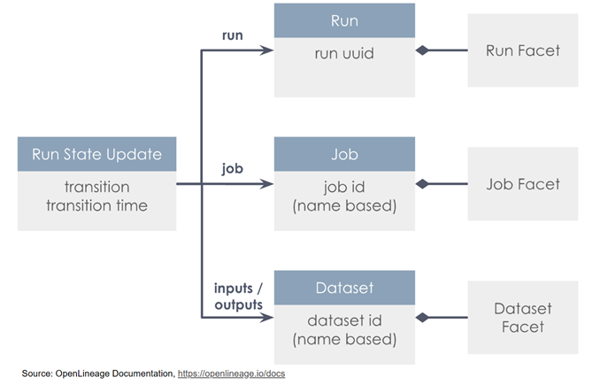
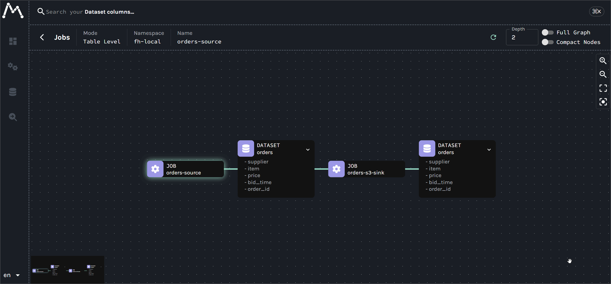
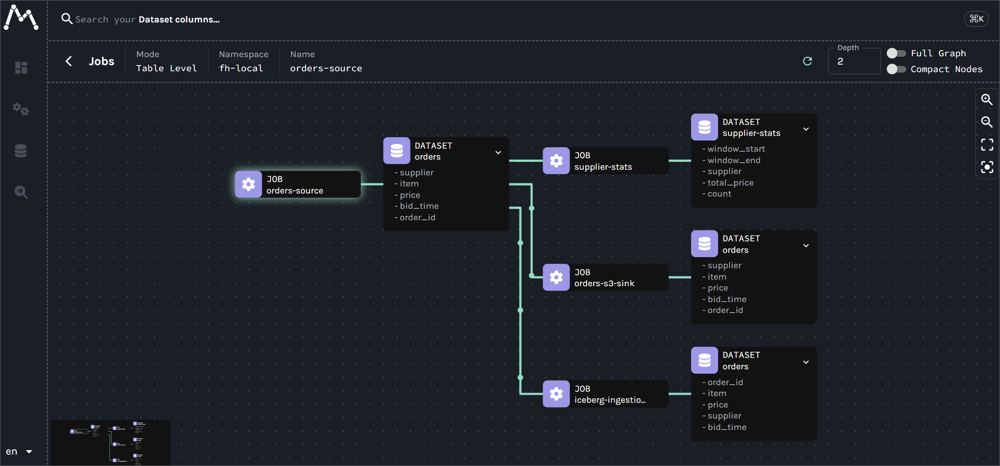
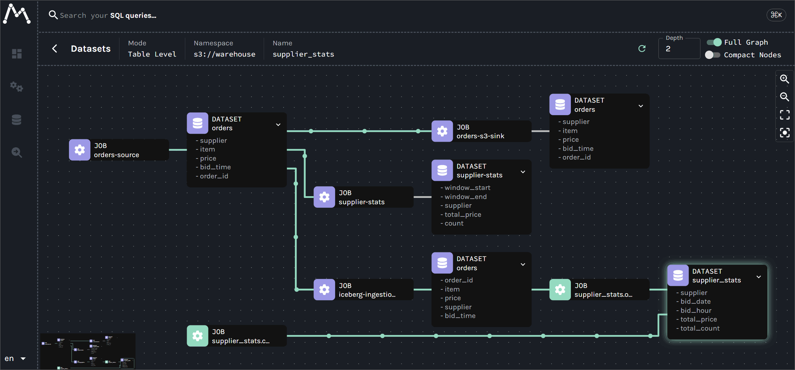

## Building End-to-End Data Lineage
#### With Kafka, Flink, and Spark

---

## What is Data Lineage?

The journey of data - where it comes from, how it’s transformed, and where it ends up.

### Why Data Lineage Matters

- **Debugging & Root Cause Analysis:** Quickly trace production bugs back to the source.
- **Impact Analysis & Governance:** See downstream dependencies before changing schemas.
- **Compliance & Audit:** Document data provenance for strict regulatory requirements.
- **Trust & Reliability:** Increase stakeholder confidence in data products.

---

## What is OpenLineage?

An open standard for capturing lineage metadata from jobs in execution.

  

    
Supports seamless collection across popular tools:

    <ul>
      <li><strong>Orchestration:</strong> Airflow, dbt</li>
      <li><strong>Compute Engines:</strong> Flink, Spark, Trino</li>
      <li><strong>Backend:</strong> Marquez (visualization)</li>
      <li>⚠️ <strong>Gap:</strong> Kafka is not an official, out-of-the-box source.</li>
    </ul>
  

  

    
  

---

## Two Lineage Paradigms

  

### Batch Lineage (Retrospective)

- **Data:** Bounded Sets
- **Lifecycle:** Finite, Scheduled
- **Capture:** At Job Completion
- **Result:** Historical Audit Trail
  

  

### Streaming Lineage (Operational)

- **Challenge:** Unbounded Streams
- **Challenge:** Continuous Jobs
- **Opportunity:** Capture **During** Execution
- **Opportunity:** A **Live, Observable System**
  

---

## Kafka: Lineage with Connect

Use a custom **Single Message Transform (SMT)** as a "pass-through" lineage agent.

- **Lifecycle Hook:** Intercepts connector states (`RUNNING`, `FAIL`, `COMPLETE`) without altering records.
- **Column-Level Depth:** Resolves fields via Avro schemas in the Schema Registry.
- **Consistent Namespacing:** Normalizes physical dataset naming (e.g., `kafka://...`, `s3://...`) for job linking.

---

## Kafka Pipeline Mapping

One lineage job tracking data flow per active connector.

---

## Flink: Integration Patterns

  

### Native `JobListener` *(DataStream API)*

- **Method:** `OpenLineageFlinkJobListener`.
- **Pros:** Simple, out-of-the-box.
- **Cons:** Fails to capture final `ABORT` transition.
  

  

### Manual Orchestration *(Table API / SQL)*

- **Method:** OpenLineage Java client.
- **Pros:** Full lifecycle event tracking.
- **Cons:** Requires custom wrapper code.
  

---

## Flink Pipeline Mapping

One lineage job mapped directly per active Flink application cluster.

---

## Spark: Final Picture

Batch Spark job reading from Flink-written Iceberg tables.

- **Agent:** Tracked via OpenLineage Java agent in `spark.extraListeners`.
- **Query Plan:** Auto-detects inputs/outputs from Logical/Physical plans.
- **Granular Actions:** Parent job with child jobs per Spark action.
- 💡 **Namespace Alignment:** Engines must agree on the same physical root namespace (e.g., `s3://warehouse`).

---

## Spark Pipeline Mapping

One lineage job registered for each execution action block.

---

## Conclusion: Key Takeaways

Bridging real-time events and historical batch processing.

- **Choose the Right Pattern**
  - **Trade-off:** Simplicity vs. Tracing Durability.
  - **Standard:** Use Native Listeners.
  - **Critical:** Use Manual Orchestration for strict lifecycle tracking.
- **Align Namespaces**
  - Essential for cross-tech lineage.
- **Start Small**
  - Instrument one critical pipeline first.
  - Establish metadata visibility, then scale outward.

---

## Project Repositories & Guides

- [OpenLineage Project](https://openlineage.io/)
- [Data Linage Lab](https://github.com/factorhouse/examples/tree/main/projects/data-lineage-labs)
